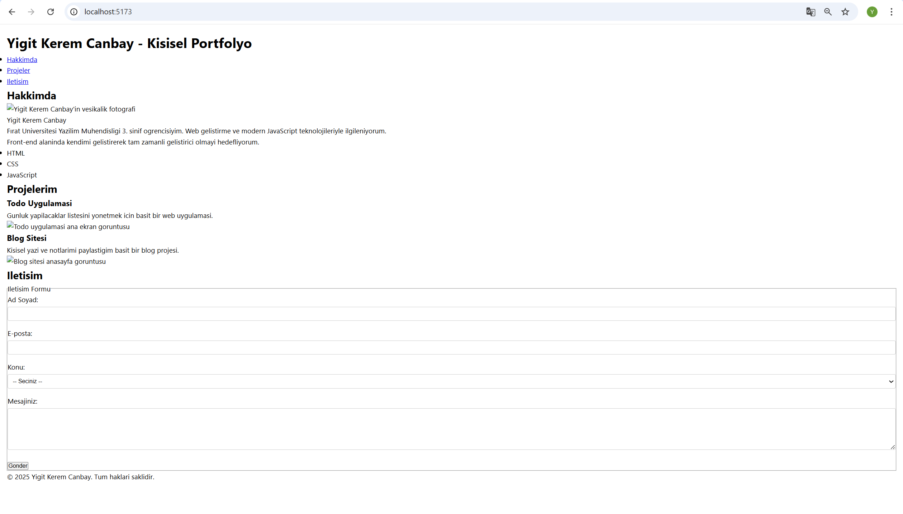
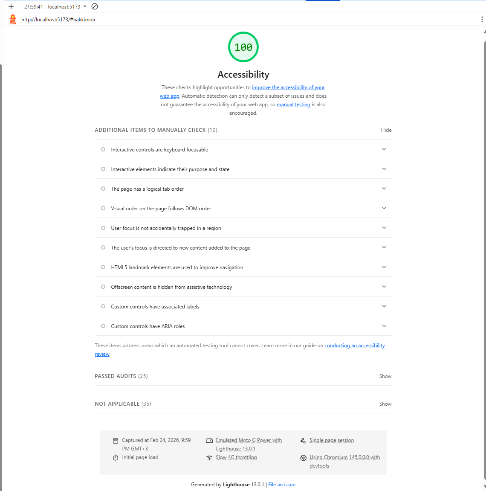

# Web LAB-1 - Hello Project

## Hakkinda
Bu proje, Web Tasarimi ve Programlama dersi LAB-1 kapsaminda **Vite + React + TypeScript** kullanilarak olusturulmus tek sayfalik kisisel portfolyo uygulamasidir.  
Odak noktasi semantik HTML, erisilebilirlik (a11y) ve dogru form yapisidir.

## Gelistirici
- **Ad Soyad:** Yigit Kerem Canbay  
- **Ogrenci No:** 235541046  
- **Universite:** Firat Universitesi, Teknoloji Fakultesi, Yazilim Muhendisligi (3. sinif)

## Kullanilan Teknolojiler
- React 18
- TypeScript
- Vite
- HTML5 semantik etiketler
- Temel CSS (erisilebilirlik odakli)

## Proje Yapisi (Ozet)
- `index.html` → Uygulama giris HTML dosyasi  
- `src/App.tsx` → Ana React bileşeni (header, main, section, article, footer, form)  
- `src/main.tsx` → React uygulamasinin baslangic noktasi  
- `src/style.css` → Global stiller ve erisilebilirlik odakli CSS  
- `public/` → Statik dosyalar (profil ve proje ekran goruntuleri)

## Kurulum
```bash
npm install
```

## Calistirma
```bash
npm run dev
```

Tarayicida `http://localhost:5173` adresini ac.

## Ekran Goruntuleri

### Ana Sayfa



### Lighthouse Accessibility Skoru


