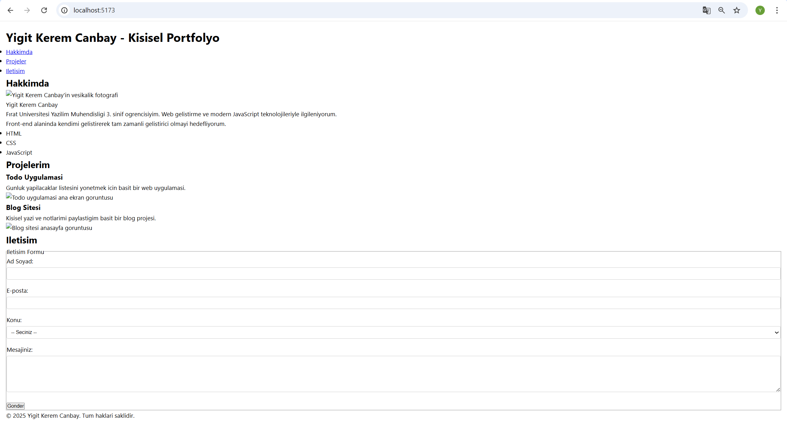
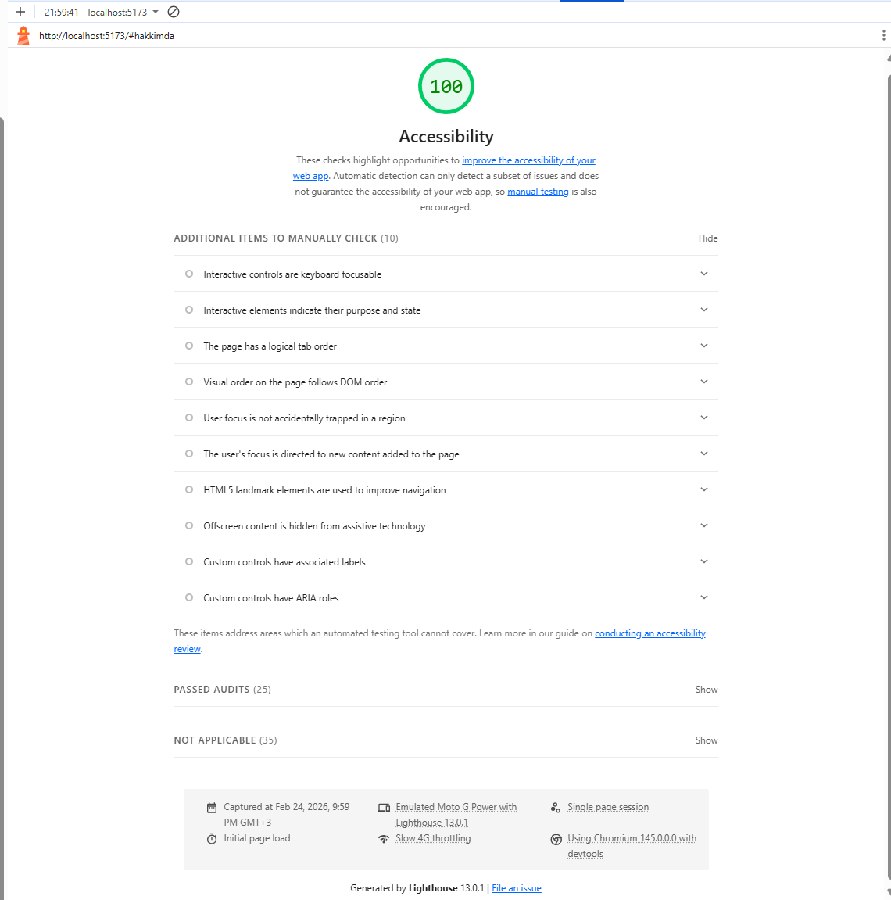
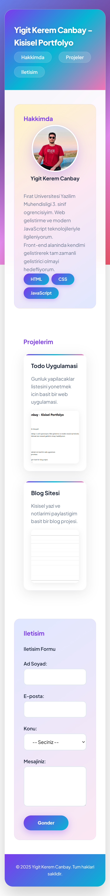
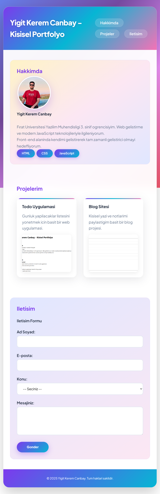

# Web LAB-1 - Hello Project

## Hakkinda
Bu proje, Web Tasarimi ve Programlama dersi LAB-1 kapsaminda **Vite + React + TypeScript** kullanilarak olusturulmus tek sayfalik kisisel portfolyo uygulamasidir.  
Odak noktasi semantik HTML, erisilebilirlik (a11y) ve dogru form yapisidir.

## Gelistirici
- **Ad Soyad:** Yigit Kerem Canbay  
- **Ogrenci No:** 235541046  
- **Universite:** Firat Universitesi, Teknoloji Fakultesi, Yazilim Muhendisligi (3. sinif)

## Kullanilan Teknolojiler
- React 18
- TypeScript
- Vite
- HTML5 semantik etiketler
- Temel CSS (erisilebilirlik odakli)

## Proje Yapisi (Ozet)
- `index.html` → Uygulama giris HTML dosyasi  
- `src/App.tsx` → Ana React bileşeni (header, main, section, article, footer, form)  
- `src/main.tsx` → React uygulamasinin baslangic noktasi  
- `src/style.css` → Global stiller ve erisilebilirlik odakli CSS  
- `public/` → Statik dosyalar (profil ve proje ekran goruntuleri)

## Kurulum
```bash
npm install
```

## Calistirma
```bash
npm run dev
```

Tarayicida `http://localhost:5173` adresini ac.

## Ekran Goruntuleri

### Ana Sayfa



### Lighthouse Accessibility Skoru



---

## Responsive Tasarim (Farkli Ekran Boyutlari)

Proje mobil (telefon), tablet ve masaustu (bilgisayar) ekranlarinda duzgun sekilde calisacak sekilde tasarlandi. Asagida her ekran boyutu icin alinan goruntuler yer almaktadir.

### Mobil Gorunum (Telefon Ekrani - 375px)

Telefonlarda sayfa tek sutun halinde gorunur. Baslik ve navigasyon ust ustadir. Hakkimda bolumundeki profil fotografi ve metin alt alta dizilir. Proje kartlari da tek sutunda listelenir. Bu sayede kucuk ekranlarda icerik rahatca okunur ve kullanilir.



### Tablet Gorunum (768px)

Tablet boyutundaki ekranlarda sayfa daha genis bir alanda gorunur. Baslik ve navigasyon yan yana hizalanir. Hakkimda bolumunde profil fotografi ve aciklama metni yatay duzende yan yana dizilir. Proje kartlari iki sutun halinde gosterilir.



### Masaustu Gorunum (Bilgisayar Ekrani - 1280px)

Bilgisayar ekranlarinda sayfa tam genislikte ve ortalanmis sekilde gorunur. Tum bolumler genis alanda rahatca okunur. Proje kartlari ekran genisligine gore otomatik olarak birden fazla sutunda dizilir. Bu sayede buyuk ekranlarda bosluk verimli kullanilir.


